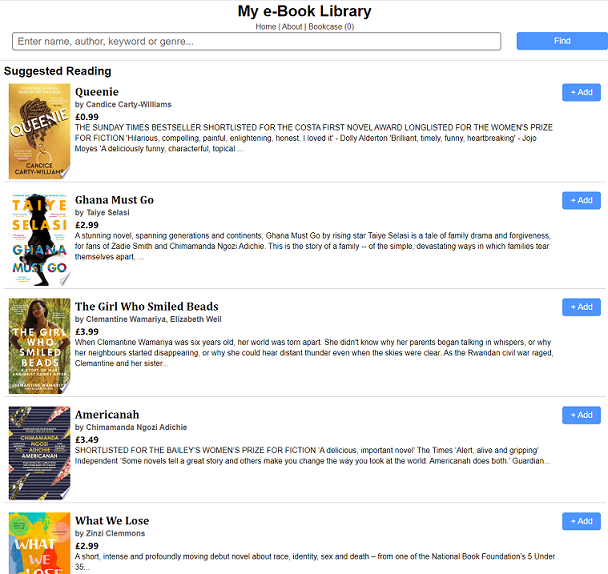

# React Assessment

For your unit 4 assessment you are required to Build a full front-end responsive React application for searching and storing books that you have read and want to read. The application will be called Bookcase. 

By the due date of this assessment you must have what is stated in the [criteria](#assessment-criteria) pushed to your GitHub ready to be marked.

## Preview


## Assessment Criteria

Ensure your app has the following functionality:

### Functionality
1. Load an initial set of suggested books from a local data store (JSON file) called `local-books.json` when the app starts up.
1. Add a book to a local list of books (*The stored books do not have to persist across sessions. When you refresh the browser the application can reset.*).
    - The application should contain one function called `addToBookcase()`
    - Ensure you cannot add the same book more than once to your local list of books.
1. Remove a book from a local list of books.
    - The application should contain one function called `removeFromBookcase()`
1. Keep a count of the number of books in your book list and display the count in the `<title>` tag and on the page in a `<h2>` element. *Consider using the `useEffect()` hook to update the title on every render*.
1. Ensure your application is broken down into components. Each component should be a logical representation of objects in your application (e.g. Book, BookList, Header, Search).

**Expected App File Structure:**
```
- public/
    |-- index.html
- src/
    |-- components/
          |-- Book.js
          |-- BookList.js
          |-- Header.js
          |-- Search.js
    |-- models/
          |-- local-books.json
    |-- pages/
          |-- About.js
    |-- styles/
          |-- App.css
    |-- App.js
    |-- index.js
```

### Navigation

5. Allow a user to view an about us page called `About.js` explaining the application functionality.

### Search 

6. The app will connect to a third-party API provided by Google [(Books APIv1)](https://developers.google.com/books/docs/overview).

1. Add a search form to the home page of the app (see [screenshot](#preview) above and [example app](#example-project) below).

1. A user should be able to search for a book with the following criteria:
    - Title of book
    - Name of author
    - **Optional:** Genre of book (e.g. Fiction, Romance, Crime, Horror), [see subject/inauthor](https://developers.google.com/books/docs/v1/using#PerformingSearch). 

### Advanced Navigation

9. Add pagination (next and previous buttons). *This will require storing the book data and page number in state, then only showing so many results per page*
1. Add numbered pages and display the results of the search.

### Styling/Animation/Interactivity

11. Add some animation or transitions to the application, i.e.
    - Consider animating the selection and deselection of books.
    - An animated results count when the search returns more than one page of results. 
1. Consider changing the look and feel of the search page compared to the personal books store
1. Add a dark mode to the app

## How to submit

Commit all created/generated files and folders to the repo and push to your remote repo for assessment.

## Example Project

- [Example Bookcase Application](https://example-bookcase.netlify.app)


